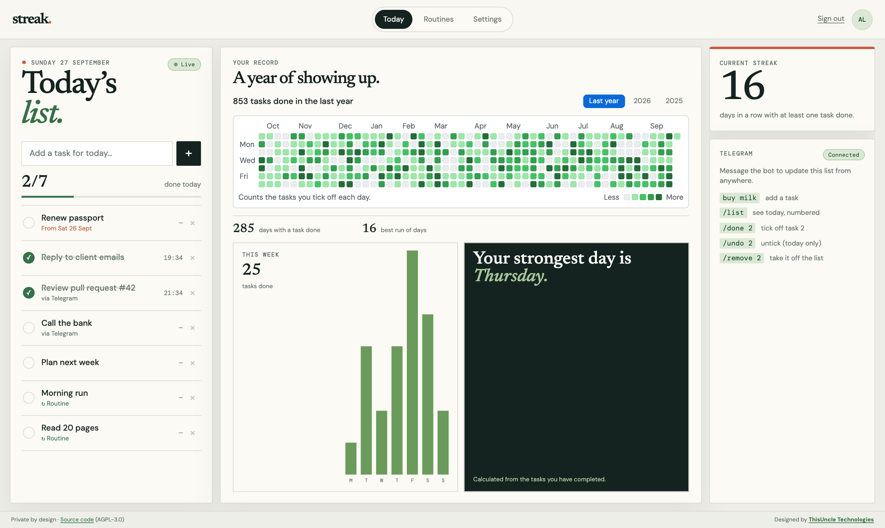
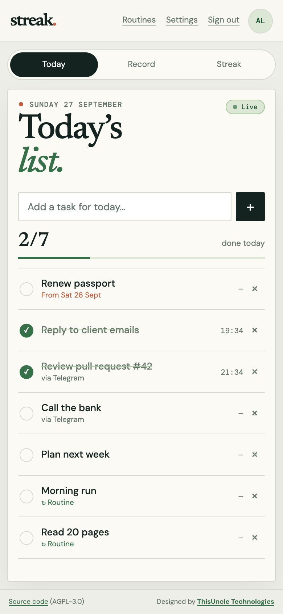
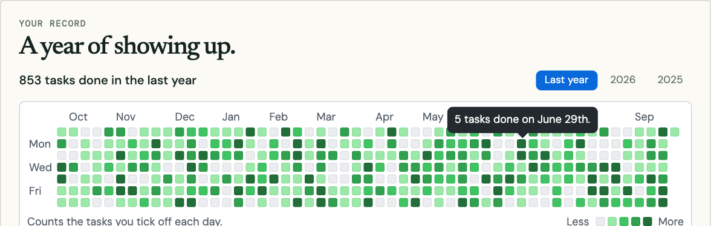
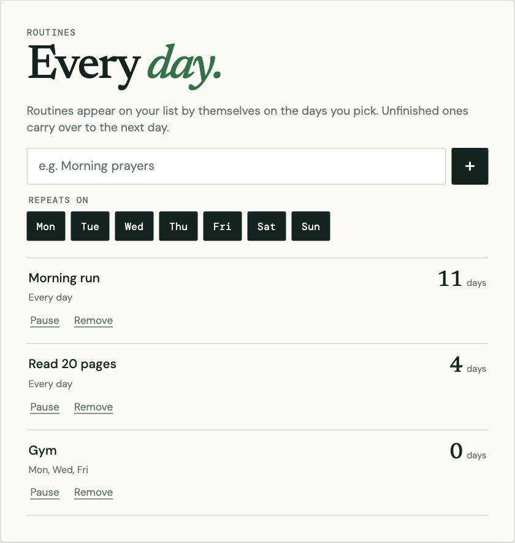

# Streak

[](https://github.com/victorjudysen/streak/actions/workflows/deploy.yml)
[](LICENSE)

A private daily list you run yourself. Add and tick off tasks in the web app or
by messaging your own Telegram bot, keep routines that repeat on the days you
choose, and watch a year of showing up fill in on a GitHub-style activity graph.

Streak is built for **one person per install**: you deploy your own copy, with
your own database and your own bot, and nobody else can see your list.



## Features

- **Daily list.** Add, tick off and remove tasks. Ticked-off tasks leave the list
  and wait in a folded “Done today” section, where you can untick a mis-tap.
  Unfinished tasks carry over to the next day, labelled with the day they came
  from.
- **Telegram bot.** Send a message to add a task, tap a button to tick it off,
  or use `/list`, `/done 2`, `/undo 2` and `/remove 2`. Only your chat can use it.
- **Plan ahead.** Schedule a task for any day in the next year, from the app’s
  date picker or by starting a Telegram message with a day (`fri: Gym`). It
  waits in a folded “Upcoming” section and appears on the list that morning.
- **Edit tasks.** Rename a task or move it to another day with the ✎ button, or
  `/edit 2 New title` and `/move 2 fri` in Telegram. Moving an old unfinished
  task lets the original go (kept on record) and plans a fresh copy.
- **Morning message.** Every day at 9am your time, the bot sends today’s list
  with a number to tap for each task.
- **Routines.** Tasks that repeat on chosen weekdays and appear on the list by
  themselves, each with its own streak.
- **GitHub-style activity graph.** A year of completed tasks, shaded relative to
  your other days, with a hover tooltip and a view per calendar year. Click a
  day (or use the arrow keys and Enter) to see exactly what you finished then.
- **Live updates.** Tick something off in Telegram and the open dashboard updates
  within a second.
- **Honest records.** Past days are closed: a completion can’t be backfilled or
  erased later, from the app or the bot.
- **Private by design.** One password, a signed login cookie, and a database the
  public key can’t read. All data access goes through your server.

| Phone | Activity graph | Routines |
| --- | --- | --- |
|  |  |  |

## How it behaves

- **Today** is decided in your configured time zone (`STREAK_TIMEZONE`), not the
  server’s clock.
- **Carry-over.** Unfinished tasks and routines from earlier days stay on today’s
  list until you tick them off or let them go. Letting go hides a task but keeps
  it on record.
- **Closed days stay closed.** A completion recorded on an earlier day can’t be
  undone or removed.
- **Routines** appear on their scheduled days. Removing today’s copy skips it for
  today only. Pausing stops it until you resume; removing it stops it for good
  and keeps its history.
- **The activity graph** works like GitHub’s contribution graph: Sunday-first
  weeks ending today, one square per day shaded by quartile of your active days
  (so one huge day doesn’t wash out the rest), and year buttons (`/?year=2025`).
  Clicking a square lists that day’s completed tasks (`/?day=2026-06-30`),
  read-only, with the time each was ticked off.
- **Streaks and stats** are calculated only from real completion times.
- **Editing** a Telegram message you already sent does nothing; send a new one.

## The Telegram bot

The bot’s list shows only what’s left to do, grouped under the day each task was
planned for (“Sat, Oct 3rd”, “Today · Mon, Oct 5th”) and numbered 1, 2, 3… across
the groups, with your progress at the top (“4/8 done today”). When you finish
something it drops off and the rest renumber. The web app groups today’s list and
Upcoming the same way.

| Message | What happens |
| --- | --- |
| `Call the bank` | Adds a task for today. Several lines add several tasks. |
| `/list` | What’s left today, numbered, with a button for each number. |
| `/done 2` | Ticks off task 2. Also `/done 1 3`, `/done 2-4`, `/done all`. |
| `/remove 2` | Deletes a task added today, or lets go of an older unfinished one. |
| `/undo` | Shows what you’ve ticked off today, numbered. `/undo 2` unticks the 2nd. |
| `tomorrow: Call the bank` | Schedules a task for another day. Also `fri: …`, `12 oct: …`, `2026-10-12: …`, or `/add fri: …`. Text before a colon only counts if it’s a day. |
| `/upcoming` | What’s scheduled for later days. |
| `/edit 2 New title` | Renames task 2. |
| `/move 2 tomorrow` | Moves task 2 to another day (`/move 2 to fri` works too). |

Tap a task’s number under the list to tick it off; the message updates in place. Numbers in a
command always refer to the list as it was when you sent it.

## Run your own

You need free accounts on [Supabase](https://supabase.com) (database),
[Netlify](https://www.netlify.com) (hosting) and, for the bot,
[Telegram](https://telegram.org). The full guide, including every setting, is
in **[docs/self-hosting.md](docs/self-hosting.md)**. In short:

1. Fork this repo and create a Supabase project; apply the migrations with
   `supabase db push`.
2. Copy `.env.example` to `.env.local` and fill it in.
3. Deploy to Netlify and add the same settings there.
4. Create a bot with @BotFather, run `npm run telegram:setup`, and lock the bot
   to your chat.

## Development

Next.js 16 (App Router), TypeScript, Supabase Postgres, plain CSS, Vitest.

```bash
npm install
npm run dev             # http://localhost:3000
npm test                # unit tests
npm run lint            # ESLint
npm run typecheck       # TypeScript
npm run build           # production build
npm run telegram:setup  # point the Telegram bot at APP_URL
```

How the code is organised, and the rules for changing it, are in
[docs/foundation.md](docs/foundation.md). The product’s direction and idea inbox
are in [docs/product-goals.md](docs/product-goals.md).

## Contributing and security

Contributions are welcome. Please read [CONTRIBUTING.md](CONTRIBUTING.md) first.
To report a security problem, follow [SECURITY.md](SECURITY.md) rather than
opening a public issue.

## License

Copyright © 2026 [ThisUncle Technologies](https://thisuncle.co.tz) and contributors.

Streak is free software under the
[GNU Affero General Public License v3.0 or later](LICENSE). You can use, study,
change and share it. If you run a modified version for other people over a
network, you must offer them its source code too. Set `SOURCE_CODE_URL` so the
“Source code” link in the footer points at your version.

Designed by [ThisUncle Technologies](https://thisuncle.co.tz).
